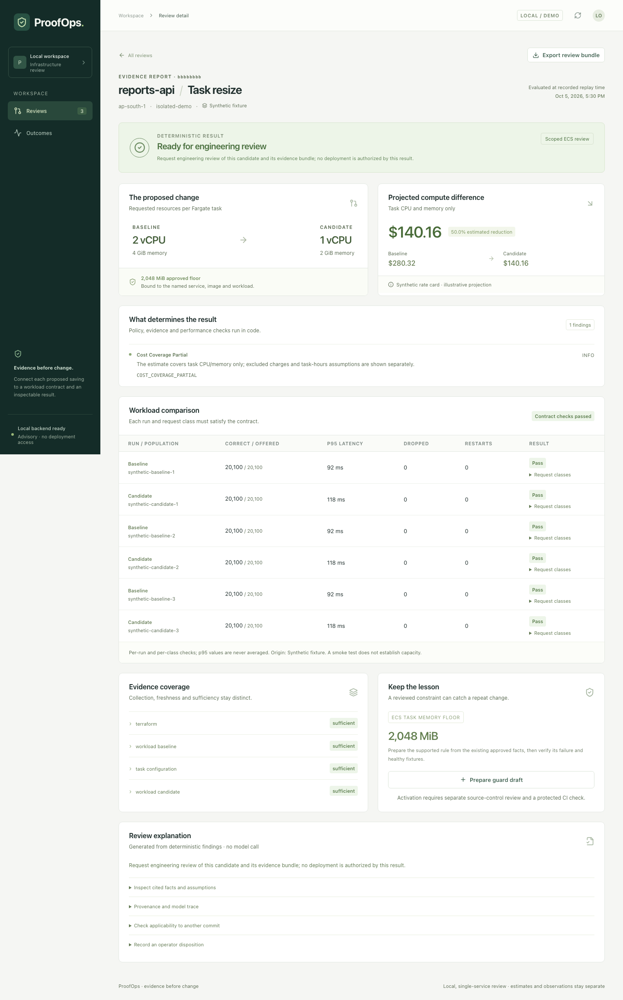
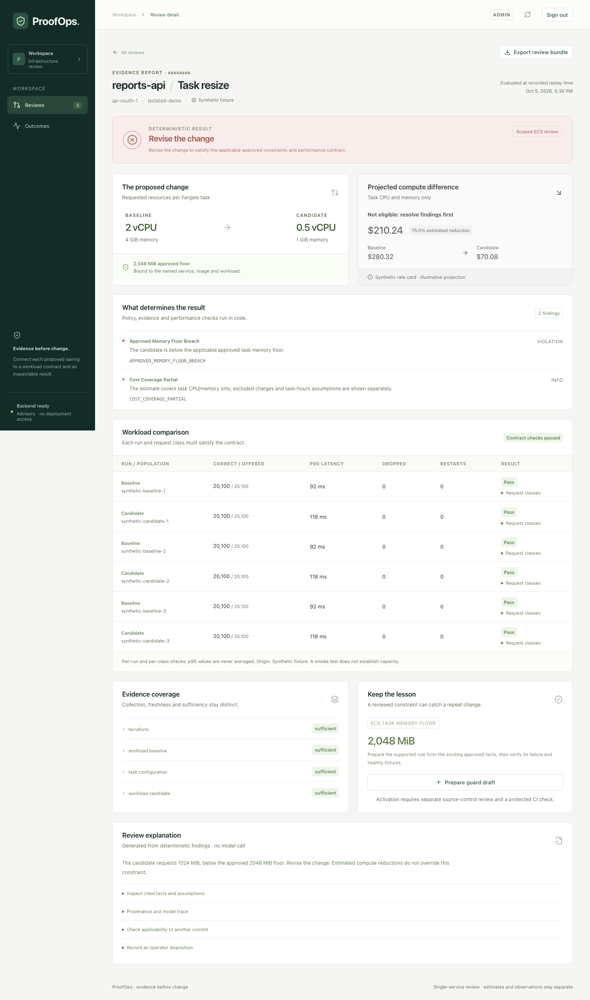
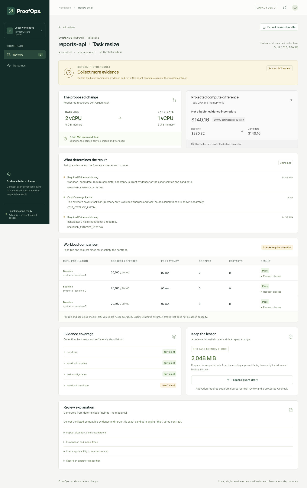

# ProofOps

ProofOps reviews a proposed ECS Fargate cost change against a versioned operating contract. It combines a sanitized Terraform plan, dated task CPU/memory estimates, workload evidence and one scoped memory guard. Code determines the result; optional AI explains it and proposes a constrained guard draft.

## Quick demo

Prerequisites: Git, Python 3 (for local secret generation), and Docker Desktop / Docker Engine with Compose v2. These commands use a macOS/Linux shell. Initial image/package downloads need Internet access; the demo needs no AWS credentials or API keys.

1. **Clone and enter the repository.**

   ```sh
   git clone https://github.com/AlainOwO/proofops.git
   cd proofops
   ```

2. **Create the local configuration** with generated database/session secrets, AI off and empty provider keys. Existing values are preserved; no password is printed.

   ```sh
   python3 scripts/configure_local.py
   ```

3. **Build and start the app, then create an admin account.** Compose runs the database migrations. Choose your own strong password at the hidden prompt; there is no default password. Account creation is needed only once.

   ```sh
   docker compose up -d --build --wait
   docker compose exec api proofops users create --username workspace-admin --role admin
   ```

4. **Replace saved reviews with the three completed demo results.** `--yes` confirms the reset; omit it for an interactive confirmation.

   ```sh
   docker compose exec -T api proofops reset-demo-data --yes
   ```

5. **Open [http://127.0.0.1:5173](http://127.0.0.1:5173) and sign in.** Recent reviews now contains exactly three results. Select a row to inspect it, then use **All reviews** to return. No **Run review** clicks are needed for this seeded demo.

   | Replay | Saved result |
   |---|---|
   | Valid resize · 4 GiB → 2 GiB | **Ready for engineering review** |
   | Unsafe resize · 4 GiB → 1 GiB | **Revise the change** |
   | Incomplete evidence | **Collect more evidence** |

For another presentation, rerun step 4. The [reset shortcut and boundaries](#replay-and-guard-commands) explain confirmation, preserved data and failure handling. The [walkthrough and screenshots](#three-scenario-walkthrough) show what to inspect in each result.

The local workflow works without AWS credentials or API keys. The supplied reviews use **synthetic evidence, rates and approvals**. Local Docker load measurements are separate observations; they do not establish an AWS x86_64 memory bound or realized savings. See [implementation status](IMPLEMENTATION_STATUS.md), [test results](docs/testing.md) and [limitations](docs/decisions.md).

## Start with Docker

Prerequisites: Git, Python 3 and Docker Desktop / Docker Engine with Compose v2. Run commands from the repository root: `proofops/` after cloning, or `proofops-app/` inside the read-only research pack. Initial image/package downloads need Internet access.

macOS/Linux:

```sh
python3 scripts/configure_local.py
docker compose up -d --build
docker compose ps
```

Windows PowerShell:

```powershell
py scripts/configure_local.py
docker compose up -d --build
docker compose ps
```

Create an admin once with `docker compose exec api proofops users create --username workspace-admin --role admin`, then sign in at **http://127.0.0.1:5173**. Choose a replay and select **Run review**. The worker processes the persisted job; the page polls actual job state. Import, inspect findings, export a reproducible bundle, prepare a guard draft, run its fixtures, and record an operator disposition. Loading the FOCUS billing sample twice preserves exactly one import.

| Service | Local address | Purpose |
|---|---|---|
| Web | `http://127.0.0.1:5173` | Reviews, evidence detail and outcomes |
| API | `http://127.0.0.1:8000` | Public `/healthz`; authenticated `/readyz`, `/docs` and API |
| PostgreSQL | `127.0.0.1:55432` | Local database; container port 5432 |
| Reporting workload | `http://127.0.0.1:8080` | Optional `workload` Compose profile |
| Experiment target | `127.0.0.1:18080` | Temporary container owned by the workload runner |

Compose runs migrations before starting the API and worker. The API and worker use the `proofops` database; tests require the separate `proofops_test` database. Compose remains bound to loopback. Authentication, server-side roles and CSRF now protect the API; exposing a deployment requires HTTPS and the hosted configuration below.

## Authentication and hosting

`admin` can import bundles, run reviews, prepare/validate guard drafts, record dispositions, import billing samples and reset demo reviews. `viewer` can read the shared workspace and download review/tested guard bundles. Create a viewer with `docker compose exec api proofops users create --username workspace-viewer --role viewer`. Both roles can sign out. There is no signup or default password.

Passwords use Argon2id. Sessions expire after eight hours by default and use HttpOnly, SameSite=Lax cookies; local HTTP explicitly disables Secure in `.env`. Every API route requires a session except the health check and login flow. State-changing requests also require CSRF validation, including login and logout. Login attempts are limited in PostgreSQL by account and connection peer.

For hosting, set `PROOFOPS_MODE=hosted`, `SESSION_COOKIE_SECURE=true`, a random `SECRET_KEY`, exact `ALLOWED_HOSTS` and HTTPS `CORS_ORIGINS`. Create a strong admin via the CLI before starting the hosted API, or supply both one-time bootstrap variables `PROOFOPS_ADMIN_USERNAME` and `PROOFOPS_ADMIN_PASSWORD`. Missing/weak auth configuration prevents startup. Put the built web app behind your TLS reverse proxy, keep database/API ports private, and keep Uvicorn's `--no-proxy-headers` setting. Use URL-safe generated database passwords with the supplied Compose file.

`PROOFOPS_PUBLIC_DEMO=true` provides anonymous viewer access to only the three unchanged results seeded by `proofops reset-demo-data --yes`. All web writes return 403, even with an admin cookie. Existing private reviews, billing, dispositions, guard drafts and model accounting remain inaccessible. Seed before enabling the flag; hosted auth configuration is still required. This flag does not publish an existing workspace wholesale.

See [security and auth setup](docs/security.md) for exact setup, migration, credential rotation, CSRF and demo instructions. This is one shared workspace, with no tenant isolation, MFA/SSO, self-service recovery, complete security audit pipeline, retention/backup automation or supplied production TLS deployment. See [operations](docs/operations.md) for remaining deployment responsibilities.

## Three-scenario walkthrough

After the Quick demo, open **Reviews** at **http://127.0.0.1:5173/#/reviews** and select each saved row by its **Decision** badge. Use **All reviews** between scenarios. These scenarios use synthetic inputs and require no AWS or model API calls.

1. **Valid resize · 4 GiB → 2 GiB:** open **Ready for engineering review** (`request_review`). Inspect **The proposed change**: the 2 GiB candidate meets the fixture's 2,048 MiB approved floor. **Workload comparison** shows the compatible runs passing their contract checks. The cost difference is an illustrative estimate; the result requests engineering review and grants no deployment permission.
2. **Unsafe resize · 4 GiB → 1 GiB:** open **Revise the change** (`revise_change`). **What determines the result** explains the applicable memory-floor violation. Under **Keep the lesson**, select **Prepare guard draft**, then **Run guard fixtures** to inspect and export the tested rule. The draft remains **Not active**; revise the candidate before requesting another review.
3. **Incomplete evidence:** open **Collect more evidence** (`collect_evidence`). Inspect **Evidence coverage** and **Workload comparison** for the missing candidate artifacts. A projected cost difference does not supply workload evidence. Collect compatible candidate evidence and rerun the review.

To submit another review manually, choose **Valid resize · 4 GiB → 2 GiB**, **Below the floor · 4 GiB → 1 GiB** or **Missing candidate evidence**, then **Run review** with the API and worker running. Keep **Recorded replay time** and **Deterministic template · no AI call** under **Import or configure a review**. Each submission adds a saved review; the reset shortcut restores the three-result presentation.

For any completed scenario, expand **Inspect cited facts and assumptions** and select **Export review bundle** to inspect the saved basis. A downloaded bundle can be reproduced with the replay command below. Historical or changed-revision notices describe current applicability separately from the saved result.

These screenshots show the three seeded synthetic results with template explanations. Expand a result to see its full page; all names, identifiers and evidence shown come from the supplied fixtures.

<details>
<summary>Valid resize — Ready for engineering review</summary>



</details>

<details>
<summary>Unsafe resize — Revise the change</summary>



</details>

<details>
<summary>Incomplete evidence — Collect more evidence</summary>



</details>

To regenerate only these three screenshots with the existing Playwright setup, install the native frontend/browser prerequisites below, reset the demo, then run from the app root:

```sh
docker compose exec -T api proofops reset-demo-data --yes
.venv/bin/python scripts/prepare_browser_auth.py
cd frontend
npm run screenshots:demo
```

The setup script creates synthetic accounts with random passwords in ignored `artifacts/private/browser-auth.json`; use it only with the local, AI-off workspace. The capture signs in with those credentials, checks that exactly three completed replays are present, their input hashes match the supplied fixtures, and their explanations use template mode. It reads the saved results and writes `docs/screenshots/` plus ignored Playwright check artifacts. It does not submit more reviews. Usernames/passwords never appear in the captures; network traces are disabled. Run it after e2e tests, which intentionally create additional reviews.

## Replay and guard commands

Reset shortcut (API container running):

```sh
docker compose exec api proofops reset-demo-data
```

Confirm with `y` or `yes`; an empty answer, refusal or closed input cancels with exit 1. For an unattended reset, use `docker compose exec -T api proofops reset-demo-data --yes`. Native equivalent: `.venv/bin/proofops reset-demo-data`.

Reset replaces all saved reviews, guard drafts, dispositions and imported bundle records with exactly three **completed**, AI-off replays at their recorded times. It does not need the worker. It only accepts the local `proofops` database (or `proofops_test` for tests), refuses while a review is running, and rolls back database changes if seeding fails. Billing, trusted contracts/policies, model accounting/cache, audit history and existing files/exports are preserved. Evaluation, research and evaluator data are outside the reset; no directories are cleared.

These commands also work inside the API container:

```sh
docker compose exec api proofops review --bundle fixtures/replays/valid-resize --ai off --output artifacts/review
docker compose exec api proofops replay artifacts/review
docker compose exec api proofops guards test
```

With the native environment below, omit `docker compose exec api` and use `.venv/bin/proofops` (PowerShell: `.venv\Scripts\proofops.exe`).

```sh
.venv/bin/proofops review --bundle fixtures/replays/unsafe-resize --ai off --output artifacts/unsafe
.venv/bin/proofops review --bundle fixtures/replays/incomplete-evidence --ai off --output artifacts/incomplete
.venv/bin/proofops replay artifacts/unsafe
.venv/bin/proofops guards test --policy-dir policies/approved --fixtures fixtures/negative_cases
.venv/bin/proofops ingest-costs --file fixtures/billing/focus_sample.csv
.venv/bin/proofops evaluate --manifest evaluation/manifest.json --mode replay
```

`review` exits **0** for ready-for-review or labelled out-of-scope, **2** for revise, **3** for collect evidence, and **1** for input/execution failure. `--require-supported` changes out-of-scope to exit 3. `--format json` and the default human summary agree. `replay` exits 0 when the saved deterministic report is reproduced, including a correctly rejected change. A guard fixture command checks only the memory rule.

Output includes `report.json`, `explanation.json`, `summary.md` and `review.zip`. Exported inputs are normalized and sanitized; the original secret-bearing plan is discarded. Replay uses the recorded evaluation time and trusted snapshot. It does not refresh applicability or authorize deployment. Copy downloaded ZIPs under `artifacts/` before using the replay CLI.

## Native development and testing

Optional runtime controls are documented in [operations](docs/operations.md).
Accepted AI output caching is configurable; [AWS observation caching](docs/aws.md)
retains original evidence timestamps. The [optional research tool](docs/tools.md)
is disabled by default and available only through an explicit CLI command. It
does not affect review outcomes or the existing UI. Both hosted stacks keep AI
and research off. [Worker controls and operation logs](docs/operations.md#worker-execution-and-lightweight-measurements)
use the existing PostgreSQL queue; upgrades require the documented owner migration.
See [CHANGES.md](CHANGES.md) for the current optimization pass,
verification and measurement limits.

Use Python 3.12, uv 0.12.23, Node 22 LTS and Docker for PostgreSQL. The host build was verified on macOS ARM64; Docker supplies Linux containers. PowerShell instructions are provided but were not executed on this host.

macOS/Linux (a Python 3 interpreter is enough to bootstrap uv):

```sh
python3 -m venv .bootstrap
.bootstrap/bin/python -m pip install uv==0.12.23
.bootstrap/bin/uv python install 3.12
.bootstrap/bin/uv sync --frozen --group dev --group docs
python3 scripts/configure_local.py
docker compose up -d db
.venv/bin/alembic upgrade head
.venv/bin/python scripts/create_test_database.py
.venv/bin/python scripts/install_tools.py
```

PowerShell:

```powershell
py -3 -m venv .bootstrap
.bootstrap\Scripts\python.exe -m pip install uv==0.12.23
.bootstrap\Scripts\uv.exe python install 3.12
.bootstrap\Scripts\uv.exe sync --frozen --group dev --group docs
py scripts/configure_local.py
docker compose up -d db
.venv\Scripts\alembic.exe upgrade head
.venv\Scripts\python.exe scripts/create_test_database.py
.venv\Scripts\python.exe scripts/install_tools.py
```

Choose Docker or native processes for the same ports. If switching to native development, stop the container API/worker/web with `docker compose stop api worker web`. In three terminals, from the app root:

```sh
.venv/bin/uvicorn proofops.api.app:app --host 127.0.0.1 --port 8000 --no-proxy-headers
```

```sh
.venv/bin/proofops-worker
```

```sh
cd frontend
npm ci
npm run dev
```

For the first two commands on PowerShell, use `.venv\Scripts\uvicorn.exe` and `.venv\Scripts\proofops-worker.exe`. The frontend commands are identical. If an admin has not been created, run `.venv/bin/proofops users create --username workspace-admin --role admin` after the migration, then sign in.

Run the checks from the app root:

```sh
.venv/bin/pytest tests/unit tests/policy tests/integration -q --junitxml=artifacts/checks/backend.xml
.venv/bin/ruff check backend scripts tests evaluation demo
.venv/bin/ruff format --check backend scripts tests evaluation demo
.venv/bin/mypy backend/proofops
.venv/bin/proofops evaluate --mode replay
```

Then, with the local API, worker and web running, prepare synthetic browser identities and run all browser tests:

```sh
.venv/bin/python scripts/prepare_browser_auth.py
cd frontend
npm ci
npm run build
npx playwright install chromium
npm run test:e2e
```

On Linux, `npx playwright install --with-deps chromium` installs browser system dependencies. On PowerShell, replace Python executable paths with `.venv\Scripts\pytest.exe`, `ruff.exe`, `mypy.exe` and `proofops.exe`. Test scripts may read evaluator data; API/worker/model runtime never reads `evaluation/`, research `data/evaluator_only/`, or the RCAEval label index. Integration tests refuse any database name other than `proofops_test`.

## Workload and injected failure

The workload endpoint is `POST /v1/reports/summary`; it sums bounded integer-cent amounts. k6 independently checks the response ID, currency, count and total, including incorrect HTTP 200 responses. The full profile is eight minutes, with an 80/15/5 small/medium/large mix and 5–100 offered requests/second.

```sh
docker compose --profile workload up -d --build workload
.venv/bin/python scripts/run_workload.py all
```

The runner performs a 20-request smoke check, isolated bounded memory pressure/recovery, an eight-minute calibration baseline, then three alternating full baseline/candidate pairs. Allow about **57 minutes**. It records exact image, configuration, profile and dependency hashes, per-class results, dropped work and Docker termination state under `artifacts/workload/`. It removes only containers it created with its ownership label. Pressure stays disabled in the app and ordinary workload service.

Existing run directories are preserved. `scripts/run_workload.py compare` resumes missing comparison runs only when the frozen inputs still match. For another experiment, keep the original evidence and use the documented series option in [testing](docs/testing.md). Do not lower thresholds after observing a candidate failure.

## Configuration and boundaries

`.env.example` contains placeholders for auth/database secrets, empty API keys and `AI_MODE=off`. Never commit a populated `.env`, browser credentials/cookie state, Terraform state, private plans or API keys. Existing installations keep their database password during local setup; changing a PostgreSQL container environment variable does not rotate an existing database role. See [migration and rotation](docs/security.md#upgrading-and-rotating-credentials). No provider/model ID or price is fabricated. [Model inventory](docs/model_inventory.json) records the unconfigured roles, SDK contracts and unrun live measurements.

Live AI requires `AI_MODE=live`, an allowed provider, a verified exact model ID, its environment key, a current USD price entry in `config/model_prices.json`, and positive `AI_BUDGET_USD` and `AI_MAX_TASK_COST_USD`. Replay remains available with missing keys. The router allows at most two attempts per task, counts failed-call spend, and retains uncertain reservations after timeouts/crashes. AI cannot change a deterministic finding or activate policy. See [provider contracts](docs/provider_contracts.md) and [operations](docs/operations.md).

The optional collector uses the normal boto3 credential chain, validates the STS account and reads only a configured service. `proofops collect --mode live` requires scope configuration matching a separately reviewed contract. It is not needed for replay. [AWS setup and IAM](docs/aws.md) describes exact actions and costs; [the optional Terraform demo](infra/aws-demo/) was formatted and validated locally, **not deployed**.

The [offline CI workflow](.github/workflows/offline.yml) runs without cloud/model secrets. Its trusted-policy example loads code, policy and mapping from the base revision and reads bounded candidate data. Local equivalents were tested; no remote GitHub workflow or protected deployment check was configured. See [CI trust](docs/ci.md).

## Documentation and cleanup

- [Project overview PDF](docs/pdf/ProofOps_Project_Overview.pdf)
- [Technical and learning guide PDF](docs/pdf/ProofOps_Technical_and_Learning_Guide.pdf)
- [Architecture](docs/architecture.md), [module reference](docs/module_reference.md), [testing](docs/testing.md), [learning path](docs/learning_path.md), [interview walkthrough](docs/interview_walkthrough.md)
- [Changes and security improvements](CHANGELOG.md), [source attribution](docs/data_sources.md), [implementation status](IMPLEMENTATION_STATUS.md)

Rebuild and validate both searchable PDFs from editable local sources:

```sh
.venv/bin/python scripts/build_docs.py
.venv/bin/python scripts/validate_docs.py
```

The committed `docs/results/` extracts make PDF rebuilding independent of live services or a new load experiment. After deliberately rerunning the local checks and full workload, `python scripts/record_results.py` refreshes those extracts from `artifacts/`; it does not invent missing measurements. The model inventory preserves null live values with reasons. Saved PDF checks are in `docs/pdf/validation.json`.

Only when the original research pack is still the app's parent folder, run `.venv/bin/python scripts/check_research.py` to audit preservation. It is not an application dependency and intentionally reports missing research inputs in a standalone checkout. Generated runtime artifacts stay under `artifacts/`; generated PDF page previews stay under `docs/pdf/rendered/`.

```sh
docker compose --profile workload down
```

This stops/removes the application's containers and network while preserving its named database/artifact volumes. Native processes stop with Ctrl+C. To erase only this app's local database and artifact volumes, use `docker compose --profile workload down --volumes` after saving needed exports. Do not delete or modify the parent research files.
