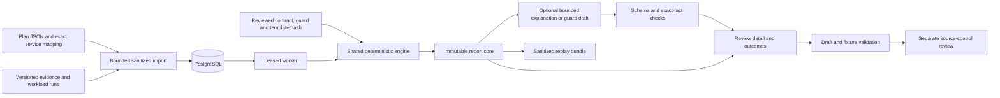

# Architecture and data flow

ProofOps is a shared-workspace review application for one explicitly mapped Linux x86_64 ECS Fargate service. Authenticated admins can submit changes; viewers can read results. A change starts with a bounded input bundle. The shared Python engine owns normalization, Decimal costs, coverage, performance comparison and the final outcome. React reads persisted backend state only after a verified session (or explicit public-demo viewer access).

The API accepts JSON replay IDs or ZIP uploads, assigns IDs, and queues jobs with a scope-bound idempotency key. Reusing the same key/body returns the same job; a changed request returns 409. The worker claims with PostgreSQL `FOR UPDATE SKIP LOCKED`, records its lease, renews bounded work and writes the deterministic report separately from AI prose. A reclaimed dispatched model call becomes uncertain; its money remains reserved and the call is not sent again.

The only enforcing guard family is `ecs_task_memory_floor`. A trusted revision binds service scope, contract hash, image/profile/dependency applicability, approved bound and exact fixed Rego template hash. A UI draft and fixture pass never activate a guard. The API can export a draft for separate review. Existing reports become historical when their commit/policy/time basis changes.

## Decisions and invariants

1. An applicable known constraint/performance violation wins: `revise_change`.
2. Otherwise missing, stale, incompatible or unknown required evidence yields `collect_evidence`.
3. Complete passing supported evidence yields `request_review`, displayed as Ready for engineering review.
4. Unsupported scope yields `out_of_scope`, a coverage result. Invalid inputs/internal errors are job failures.

Collection status, freshness and sufficiency are separate dimensions. A successful empty query is not zero errors. Evidence timestamps use UTC. Replay uses a recorded evaluation time; a current decision uses current time. Origin (`synthetic_fixture`, `benchmark`, `local_observation`, `aws_observation`) is separate from execution mode.

Costs use Decimal rates, vCPU/MiB conversions and explicit billable task-hours. They cover task CPU/memory, with excluded charges shown. Changed container limits alone do not lower task allocations. Unknown usage/rates remain null. Monthly projected costs are never divided by an unrelated short-run request count.

## Persistence and boundaries

PostgreSQL stores contracts, changes, normalized evidence, workload runs, leased jobs, immutable reports, guard revisions/drafts, outcomes, attempts, budget ledger/cache, billing rows and audit events. Separate tables hold Argon2id users, keyed session digests with expiry, shared login limits and explicit public-demo membership. Alembic is required before authenticated readiness succeeds. Content-addressed ZIP artifacts live outside the web root in `artifacts/`; downloads resolve server-assigned hashes, not client filesystem paths.

Host and origin checks wrap a default-deny authentication boundary. Health and login are explicitly public; all other HTTP routes require a session. Every write requires admin and CSRF, except that viewers can log out with CSRF. CORS is credentialed only for configured exact origins. Public demo is a separate read-only allowlist, restricted to unchanged seeded fixture results and their original exports. Neither the authentication layer nor its database migration changes the review engine. [Security](security.md) documents session/bootstrap behavior and hosted prerequisites.

The raw Terraform plan is parsed in memory and discarded after extracting a bounded allowlist. Sensitivity/unknown metadata is retained as paths; values stay unresolved. ZIP imports reject unknown filenames, duplicate paths, traversal, symlinks, encryption and expansion beyond limits. JSON rejects duplicate keys, non-finite numbers and excessive nesting. Nothing in an imported plan/repository is executed.

Model context is built from matched report facts and original development cards/examples. It contains no research evaluator paths, labels or revealing case IDs. Provider adapters have no tools. Mechanical schema/citation checks do not prove causal reasoning; evaluator annotations score semantics separately. API/worker containers do not contain the evaluation corpus.

Multiple users share one workspace; tenant/per-review isolation, MFA, production TLS deployment, retention and complete auth auditing are not implemented. Team enforcement also needs deployment-specific approvals and protected trusted workflows. Kubernetes, other services/clouds, autonomous deployment and trained routing remain outside this build.
