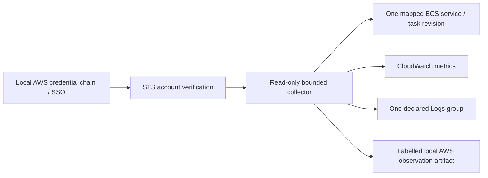

# AWS collection and optional isolated demo

The implemented collector calls STS `GetCallerIdentity`, ECS `DescribeServices`, `DescribeTaskDefinition`, `ListTasks` and `DescribeTasks`, CloudWatch `GetMetricData`, and CloudWatch Logs `StartQuery`, `GetQueryResults` and `StopQuery`. boto3 uses the normal temporary-credential/SSO/assumed-role chain. There are no deployment calls in the collector.

The account, region, cluster, service, task definition ARN, allocation, image and platform must match. Mixed task revisions, incomplete pagination and unknown OS/architecture remain insufficient. Service-average CPU/memory is context, not a correctness/latency measurement. Logs are bounded and redacted; empty, pending, denied and failed states remain distinct. A content hash proves identity, not source truthfulness.



## IAM and cost scope

[readonly-collector-policy.json](../infra/aws-demo/readonly-collector-policy.json) lists exactly the implemented action set using synthetic account/scope placeholders. Replace every identity with the separately reviewed intended scope. `DescribeServices` and starting a log query are resource scoped. The sample grants read-only task enumeration/description and metric/query lifecycle actions with wildcard resources and a region condition. Some metric/query operations require wildcard resources; the task-read permissions may be narrowed further using the relevant AWS action's supported resource types and the actual task family/cluster. This sample is functional action minimization, not a claim of perfect per-resource IAM isolation.

STS caller identity normally requires no identity-policy permission; the statement documents the call. Query result retrieval/stop uses query IDs, which the API resolves. Application checks also reject a different account/region/service. Do not substitute an administrator policy.

CloudWatch Logs Insights charges depend on bytes scanned, not just returned row count. CloudWatch API calls, logs, ECR storage, task compute, NAT/egress, endpoints, load balancers and retained infrastructure can all have separate costs. No current live AWS rate was fetched or cost measured. Budget alarms monitor; they are not a hard stop.

## Terraform demonstration

`infra/aws-demo/` is optional dedicated demo HCL. It uses Terraform 1.16.5 and a locked AWS provider, an isolated name prefix, explicit expected account, private subnets/security groups supplied by the operator, Linux x86_64, a pinned ECR image, one-day log retention and **zero running tasks by default**. The task role has no application AWS permissions. The execution role can pull the declared repository and write the declared log group.

Local validation (no plan/apply):

```sh
.venv/bin/python scripts/install_terraform.py
.tools/bin/terraform -chdir=infra/aws-demo init -backend=false -input=false
.tools/bin/terraform -chdir=infra/aws-demo fmt -check
.tools/bin/terraform -chdir=infra/aws-demo validate
```

No AWS environment was deployed. A future authorized run needs a dedicated account/region, a built and verified Linux x86_64 image, exact private networking/egress, a short duration and an explicit spending allowance. Build a matching trusted contract, service mapping and collector configuration; the current synthetic guard is not an AWS approval. After reviewing a plan, a human can choose whether to apply and start one task. No deployment step is part of local setup.

Cleanup for a future deployment must use that exact directory/state: review `terraform -chdir=infra/aws-demo plan -destroy`, then explicitly authorize `terraform -chdir=infra/aws-demo destroy`. Existing subnets/security groups are inputs and are not owned by this module. Inventory ECR/networking/retained artifacts separately. Never destroy unrelated state or assume scaling to zero removes every charge.

Sources: [Fargate task sizing](https://docs.aws.amazon.com/AmazonECS/latest/developerguide/task-cpu-memory-error.html), [Fargate pricing](https://aws.amazon.com/fargate/pricing/), [ECS IAM actions](https://docs.aws.amazon.com/service-authorization/latest/reference/list_amazonelasticcontainerservice.html), [CloudWatch IAM](https://docs.aws.amazon.com/service-authorization/latest/reference/list_amazoncloudwatch.html), [Logs IAM](https://docs.aws.amazon.com/service-authorization/latest/reference/list_amazoncloudwatchlogs.html).
